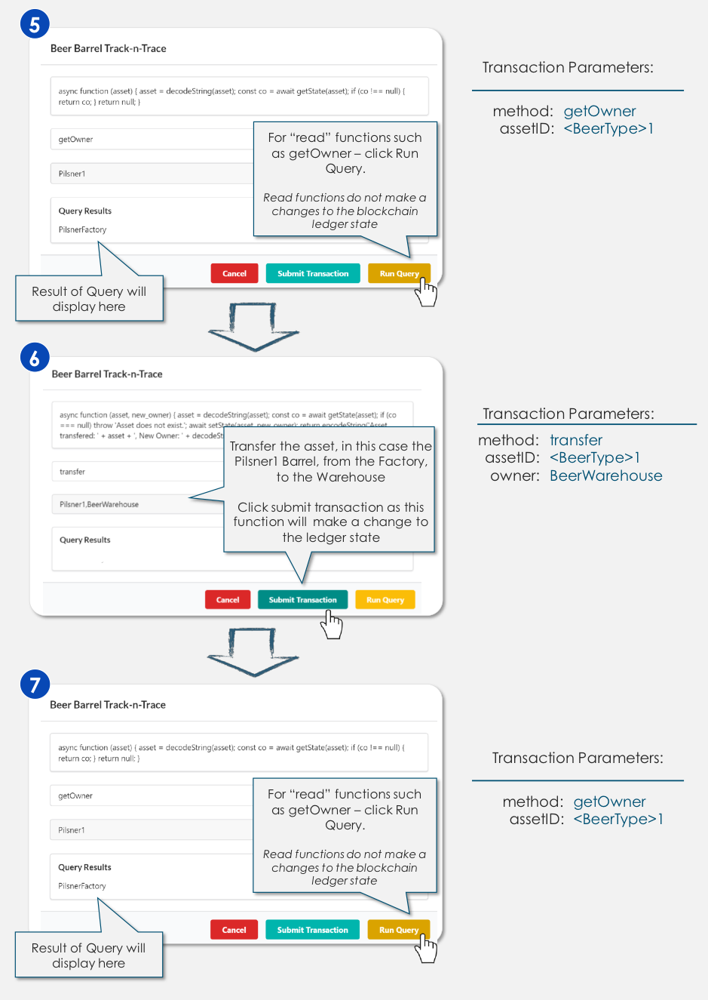
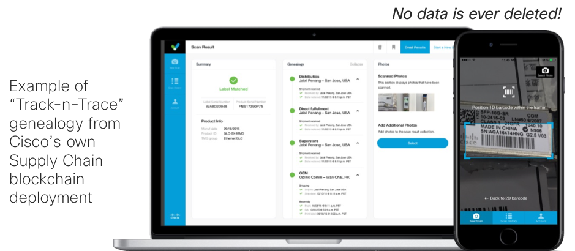

## Step 4. Create barrels of beer by sending transactions to the smart contract

Click the green “Execute Smart Contract” button from the application screen to open the transaction editor

<b>Figure 1 : Create An Asset </b>

  

Now that you are in possession of your barrels of beer, you can transfer barrels of beer by sending transactions to the smart contract

<b>Figure 2 : Send a Transaction </b>

  

Although we have defined methods and are actively changing the state of our beer barrels,

Whilst we have defined methods to change state of an object, the full history of each object retained. The ledger data is immutable.  The following figure illustrates the full history “genealogy” of a part that has been tracked through Cisco supply chain.

<b>Figure 3 : Example of Track and Trace </b>

  

Now that you have seen how assets can be transferred, go ahead and transfer all of your Beer Barrels to the beer warehouse

<b>Figure 4 : Transfer Beer to Warehouse </b>

  

#### Next Step: Verifying Transactions on the Blockchain
