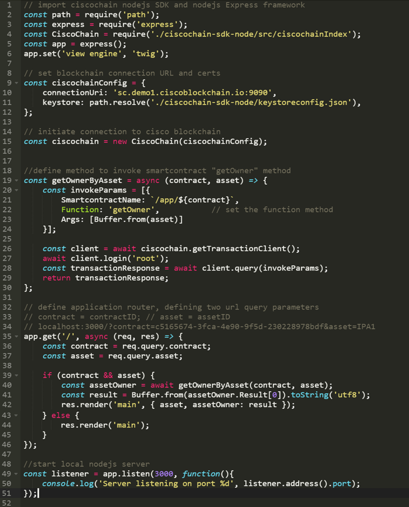

## Step 9. Additional Information

Please visit our homepage and DevNet page to stay tuned for more information. Our white paper can be found through these resources

[Cisco Blockchain Homepage](cisco.com/go/blockchain)
[Cisco Blockchain Devnet Hub ](developer.cisco.com/blockchain)

**Appendix A – Full Source Code of “Hello World” Beer Supply Chain App**

The application uses the node.js Express framework for simplicity.

`BeerSupplyChain.js	-- node.js server`

<b>Figure 1 : Application Code </b>

  

`BeerSupplyChain.twig`  	

<b>Figure 2 : Code Snippet </b>

  

#### Steps to get Started
1. Create your own git repository in Github for the learning labs that you will create and clone this repository to your workstation.  Recall that your repository must have a **labs** parent directory which is where the labs nested in their own folders will be placed.

2. Clone the git repository https://github.com/CiscoDevNet/devnet-guidelines by entering on your terminal the command `git clone https://github.com/CiscoDevNet/devnet-guidelines.git`

3. In the **labs** directory locate a template folder such as `00-labs-02-basic_template`. Copy the template folder into your **labs** directory of your repository files on your workstation.

4. Rename the directory to something that fits your lab naming structure such as: 01-npk-01-title which stands for module 1 npk lab 1 followed by a brief lab title. Open the file 1.md and begin editing the file.

5. Use the Learning Lab Previewer tool to preview your work real time.  As you edit and save your markdown files the LLP tool will automatically refresh showing your changes.  You will need to refresh the browser if you make changes to the json file of a lab.
  * The LLP tool does not fully reflect how labs will appear in the production environment.  After reviewing labs using the LLP tool, the next step is to push and review the completed labs in the Learning Labs Staged environment before putting them into production.

6. Refer to this lab as needed for guidelines.

#### Congratulations! You've completed the getting started lab! Happy Writing!
