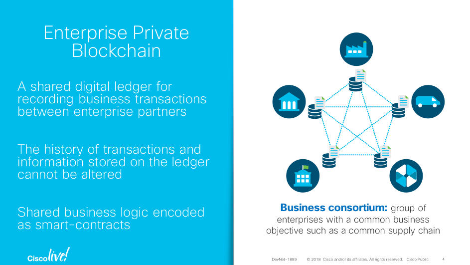
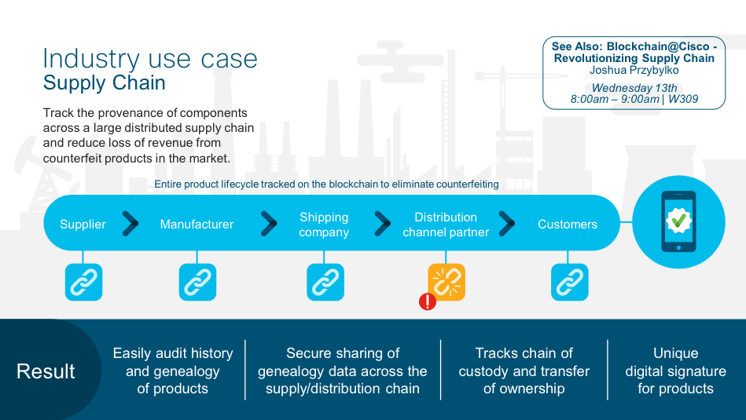
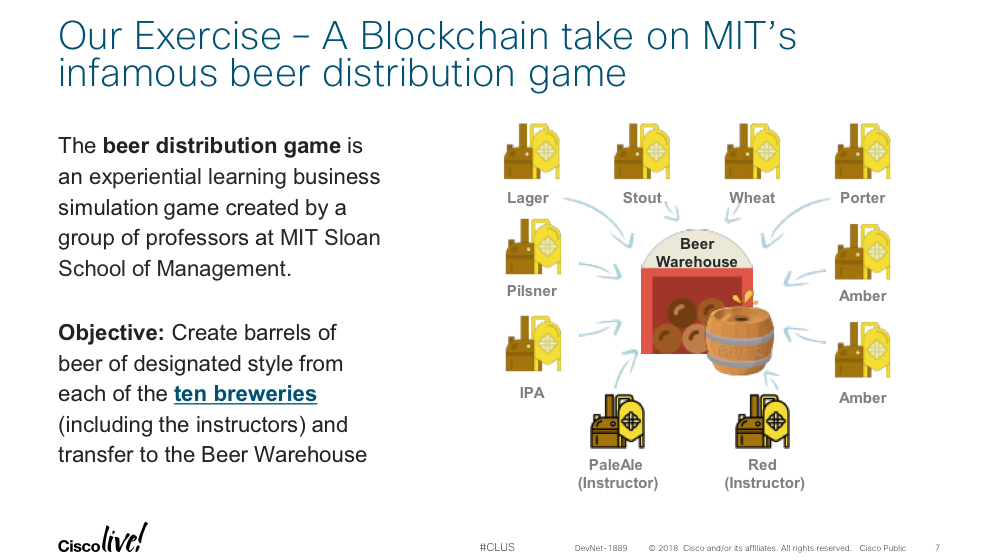

# Building Blockchain Smart-Contracts 101

This lab shows you how to create a Smart-Contract Application on the Blockchain.    

## Objectives

* Introduction to Enterprise Blockchain and Example Applications
* Introduction to the Cisco Blockchain Platform
	* Demonstration: Authoring and deploying a Smart-Contract to the Cisco’s Blockchain Platform, demonstrating a simply “hello world” use-case
	* Developer exercise: creating an asset on the blockchain using a smart-contract
* Questions and Answers

## Prerequisites

To complete this lab, you'll need a basic understanding of application development and a fundamental understanding of how a blockchain works:

* **Introducton to Enterprise Blockchain**

<b>Figure: 1 </b>
  

  

* **Example Applications of Enterprise Blockchain**

Supply chain digitization is a terrific application of enterprise blockchain. Supply chains have natural enterprise consortiums: groups of enterprises collaborating on common business objective
Blockchain provides a single data platform, with shared ownership of data, for which enterprises can transact. The blockchain is used as a tamper proof “Single source of truth” across supply chain participants addressing pain points such as data reconciliation and leading to business outcomes such as improved counterfeit part detection and management across a supply chain

<b>Figure: 1 </b>
  

  

<b>Figure: 2 </b>
  

  

* ** Exercise Overview - Authoring a smart-contract on the blockchain **

<b>Figure: 2 </b>
  

  

#### Next Step: Log into your Brewery
