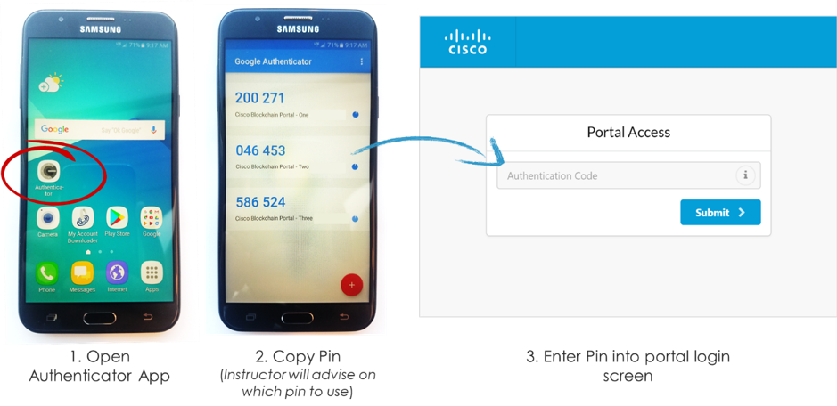
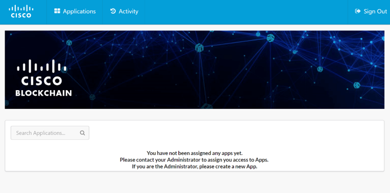

## Step 1: To Start, let us log into our Breweries

* Enter the URL provided by the instructor to go the Cisco Blockchain Portal
* Enter the credentials provided on the pack of the provisioned phone

<b>Figure 1: Login Screen</b>
  

  

* Login to the provisioned phone using the password provided on the back of each phone
* Open the authenticator application on the mobile and insert the correct authentication code based on the instructor’s guidance

<b>Figure 2: Login Screen</b>
  

  

On successful login, you should reach the following screen:

<b>Figure 2: Login Screen</b>
  

  

#### Next Step: Register a New Distributed Application (Instructor Demo Only)
