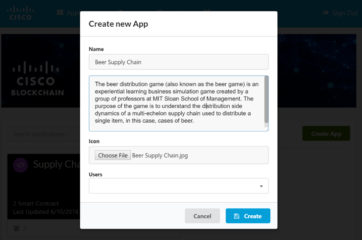
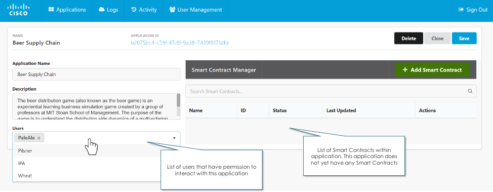
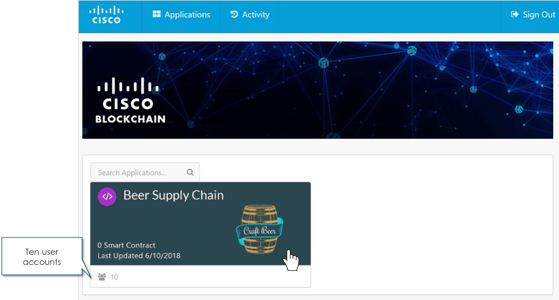

## Step 2: Register a New Distributed Application (Instructor Demo Only)

The Cisco blockchain application has multiple role based access controls (permission). For the demo to run successfully, it is important all supply chain participants interact with only one application and smart contract

Thus, the instructor will demonstrate how to create the application and smart contract. Developers will have the opportunity to interact (send transactions) to the application smart contract.

<b>Figure 1 : Home Screen</b>
  

  

<b>Figure 2 : Create a New Application</b>
  

  

On successful creation of the application, we should now see the following icon on the application screen.

**Invite the enterprise co-participants “Brewers & Warehouse” to join the application**

In a real world deployment, each of the participants would operate a blockchain node such that ownership of data and application logic on the blockchain is shared.

<b>Figure 3 : Add New Users to your Consortium</b>
  

  

On successful completion of step 2, all co-participants should be able to access the application shell

<b>Figure 4 : Users added to the Consortium</b>
  

  

#### Next Step: Create a smart-contract to describe the business rules of the consortium
