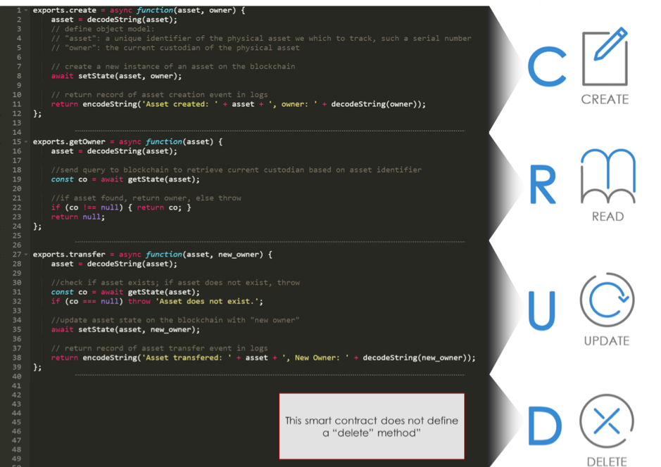
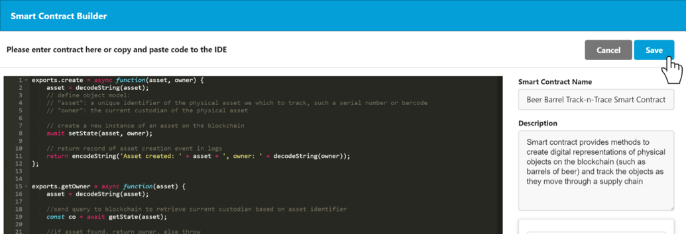

## Step 3.  Create a smart-contract to describe the business rules of the consortium

In order to execute the smart contract language needed to transfer your beer assets you will need to deploy a smart contract. First add a smart contract within the application shell

<b>Figure 1 : Add a Smart Contract </b>
  

  

Smart contracts encode the data models and application logic. For example, smart contracts are used to define rules for creating new assets on the blockchain and rules pertaining to changes of ownership. In simple applications, these rules are often grouped into four themes: Create, Read, Update, and Delete (CRUD). The principles of CRUD can be applied to smart contracts.

<b>Figure 2 : Smart contract Integrated Development Environment (IDE)  </b>
  

  

The Cisco Blockchain Platform has an inbuilt Integrated Development Environment (IDE) to make it easy to create, edit, test/debug, and publish smart contracts.

<b>Figure 2 : Smart contract Integrated Development Environment (IDE)  </b>
  

  

#### Next Step: Verifying Create barrels of beer by sending transactions to the smart contract
