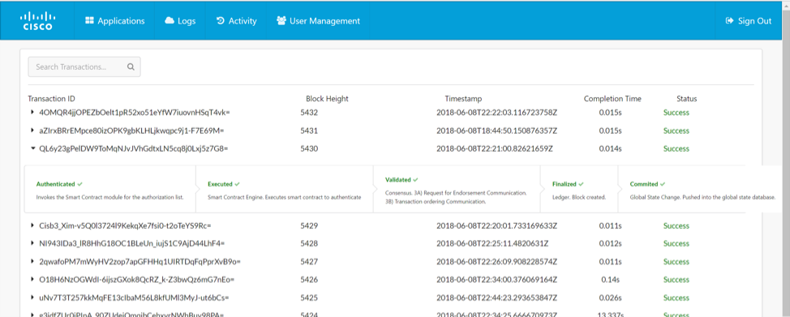
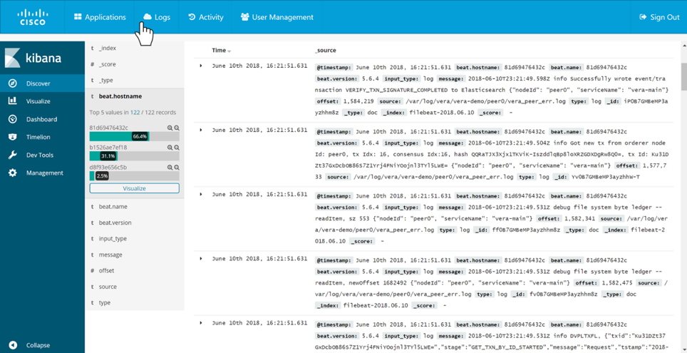
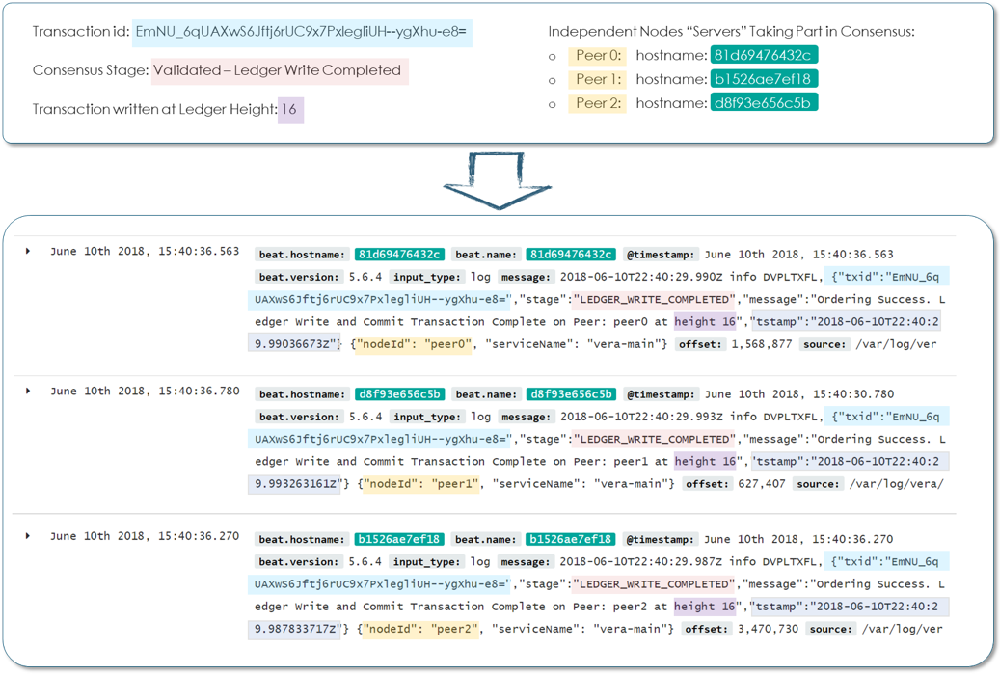

## Step 5. Verify transactions have successfully been committed the blockchain

If success is shown, the transaction has successfully completed the validation and distributed consensus procedure

<b>Figure 1 : Blockchain Transaction Log </b>

  

Inspect the system logs for details pertaining to the consensus process live across all the nodes. Log outputs show details into each respective blockchain nodes activity

<b>Figure 2 : Blockchain Explorer </b>

  

Combing through the logs it is possible to see each node confirming and writing new transactions to the ledger.

The following extract, details the “Ledger Write Complete” event for a single transaction, and the log output from three decentralized blockchain nodes

<b>Figure 3 : Blockchain Explorer </b>

  

#### Next Step: Create a simple node.js application to interact with the blockchain
