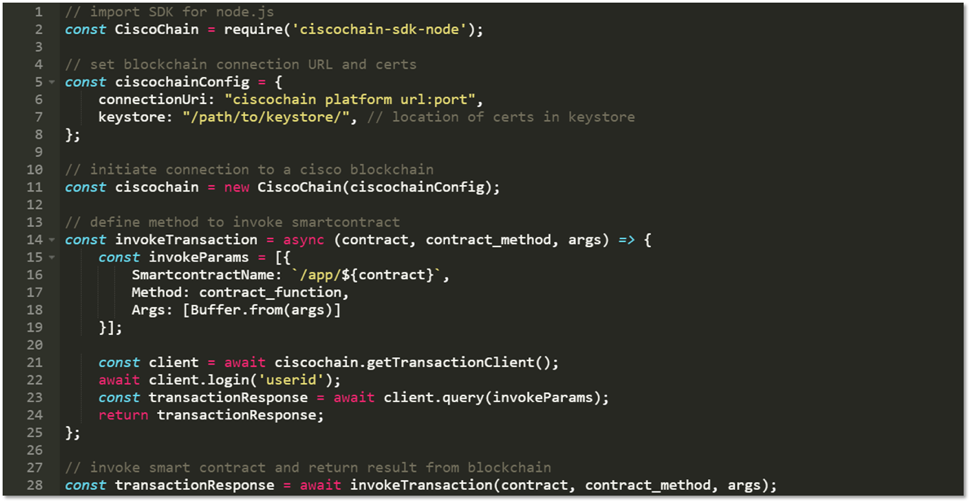
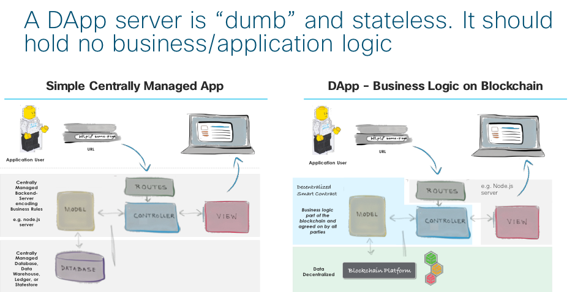
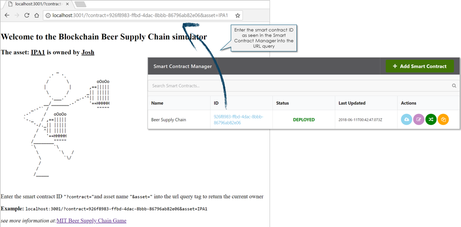

## Step 6. Create a simple node.js application to interact with the blockchain

The Cisco blockchain platform comes with a feature rich SDK for nodejs application development.

<b>Figure 1 : Outline and usage of Cisco Blockchain SDK</b>


<br/><br/>


* When writing a distributed application in node.js, we must remove all of the business logic from the application (typically defined in Controllers) and encode it into the smart contract.

* Using the simple Model View Controller framework, a nodejs distributed application simple servers to route url request and serve the end HTML (Views).

* Data schema and logic that would normally appear in the Model and Controller of an application is encoded in the smart contract.
* To this regard, application logic is shared and must be agreed upon by all participants, and application rules become an immutable component of the blockchain.

<b>Figure 2 : Outline and usage of Cisco Blockchain SDK</b>


<br/><br/>

In our sample “hello world” node.js application, we define a server that receives two query parameters from the url

```
?contract = the contract ID' as can be found in the admin portal

?asset = an assetID such as the serial number of a barrel (e.g. IPA1) that has previously been defined via the create method
```
<b>Figure 3 : Outline and usage of Cisco Blockchain SDK</b>


<br/><br/>


#### Next Step: Additional Information
